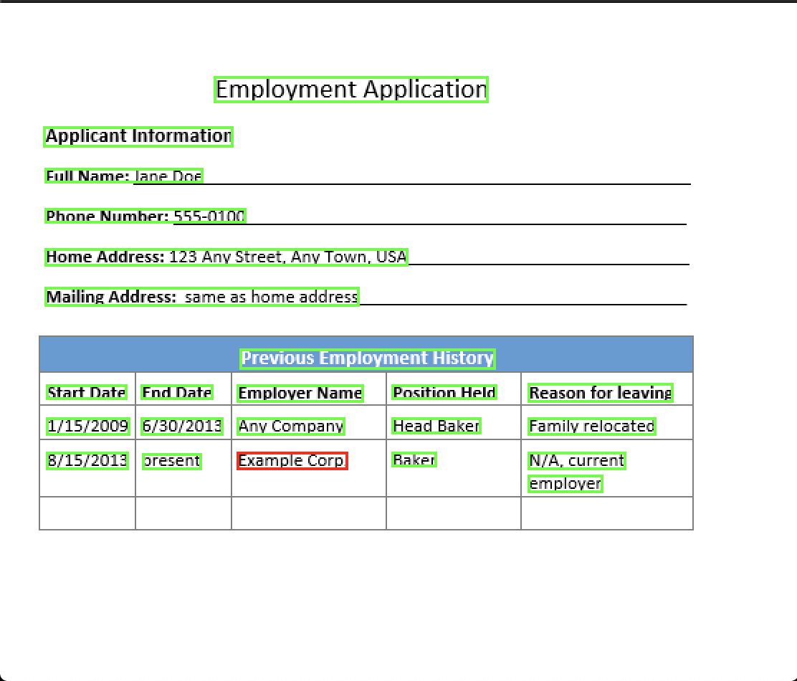
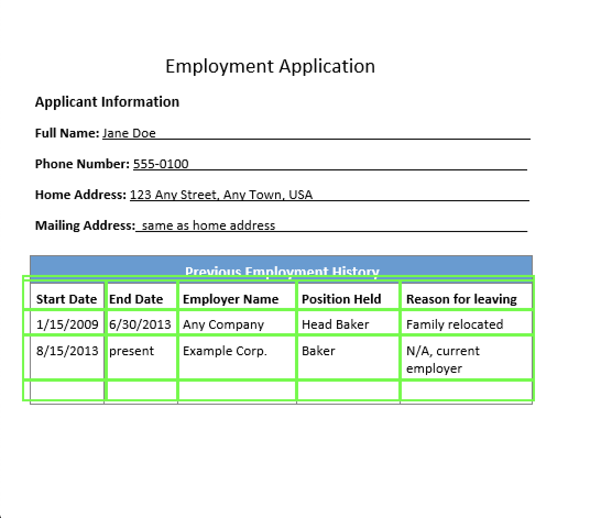
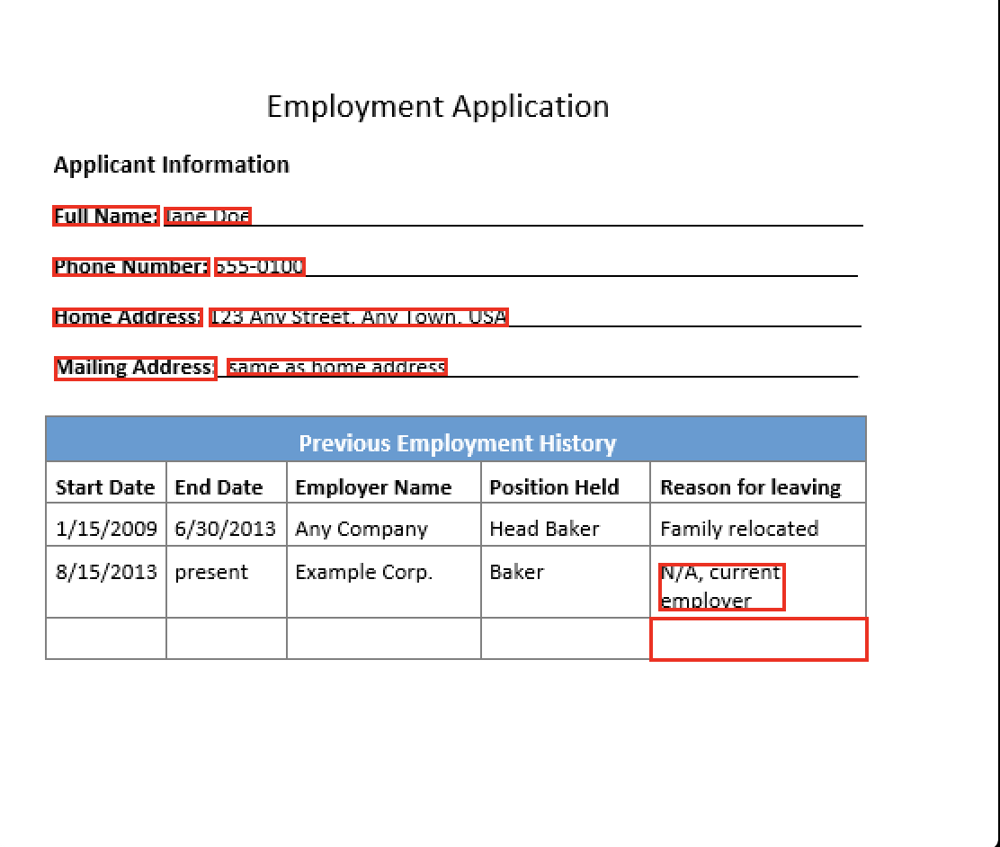

# AWS Textract Solution
This repository contains a simple solution that leverages Amazon Textract to analyze documents texts.

## The Solution
### Input


### Outputs
API         |DetectText API                                                   |AnalyzeDocument - Tables                                                |AnalyzeDocument - Formsm                                                |
:----------:|:---------------------------------------------------------------:|:----------------------------------------------------------------------:|:----------------------------------------------------------------------:|
Images:     |     | | |
Text:       |TEXT : CONFIDENCE                                                |TABLE                                                                   |FOUND KEY : VALUE pairs                                                 |                               
                

## Getting started
### Built With
* AWS SDK for Python (boto3)
* Amazon Textract
* Libraries on requirements.txt file

### Running solution
Run the following command: 
```bash
python3 text_extraction.py FILE_PATH API_TYPE FEATURE_TYPE
```
Parameters:
* FILE_PATH [REQUIRED]
* API_TYPE [REQUIRED]: which Amazon Textract Api is going to be used. It allows the values: "detect_document_text" | "analyze_document"
* FEATURE_TYPE: A list of the types of analysis to perform. Required when calling AnalyzeDocument API. It allows: "T" (for TABLES) | "F" (for FORMS) | "A" (For TABLES and FORMS).
